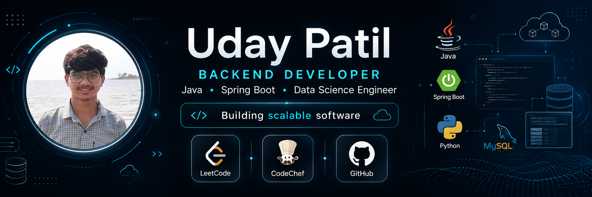

  

<h1 align="center">
  
</h1>

<h3 align="center">
  
  
  
  
</h3>

  

  
  
  

---

## 👨‍💻 About Me

I'm a **Software Engineer** passionate about designing scalable backend systems and building reliable software that solves real-world problems. With a strong foundation in **Java, Spring Boot, and AI technologies**, I bridge the gap between traditional software engineering and cutting-edge artificial intelligence.

### 🎯 Career Objective
> Aspiring Software Engineer seeking opportunities to contribute to scalable and impactful software solutions using Java, Spring Boot, and AI technologies.

### 📌 Quick Facts
- 🎓 **B.Tech in Computer Science (Data Science)** – R.C.Patel Institute of Technology, Shirpur (2023–2027) | **CGPA: 7.57**
- 🏆 **2nd Place** in Strangers Code Competition (Inter-College)
- 🚀 **A+ Grade** in Java Developer Training at R3SYS INDIA PVT LTD
- 💻 **2300+** problems solved on CodeChef
- 💻 **70+** problems solved on LeetCode

### 🛠️ My Development Philosophy
- Clean, maintainable code is as important as functional code
- Continuous learning and adaptation to new technologies
- Building production-ready solutions with scalability in mind
- Combining backend expertise with AI capabilities

---

## 🌐 Connect with Me

  
  
  
  
  
  

---

## 💻 Tech Stack

### 🔷 Languages

  
  
  

### 🔷 Backend Development

  
  
  
  
  
  
  

### 🔷 Frontend

  
  
  
  
  

### 🔷 Database

  
  

### 🔷 AI & Machine Learning

  
  
  
  
  
  

### 🔷 Tools & IDEs

  
  
  
  
  
  

---

## 🚀 Featured Projects

### 🎯 TaskSync Platform
> **Spring MVC-based Freelance Hiring Platform**
- Role-based portal connecting clients and freelancers
- Job postings, bid approvals, and project tracking
- Automated reward distribution upon completion
- **Tech Stack:** Spring MVC, Hibernate, JDBC, MySQL
- **Grade:** A+

### 🤖 Nexus Scholar
> **AI-Powered Research Paper Summarizer**
- Hybrid extractive-abstractive summarization system
- Uses Sentence Transformers and DistilBART
- Generates concise, context-aware summaries from PDFs
- **Tech Stack:** Python, NLP, Transformers, Generative AI

### 🦻 DeafAssist AI
> **Environmental Sound Detection System**
- Real-time classification of 10 urban sound categories
- Visual hazard alerts for hearing-impaired individuals
- **Tech Stack:** Deep Learning, Computer Vision, Python

### 🌾 Agronomic Solutions Platform
> **Three-tier Agricultural Web Portal**
- Farmers report issues, experts deliver solutions
- Full-stack application with role-based authentication
- **Tech Stack:** Advanced Java, JSP, Servlets, MySQL

### 📚 EduMind RAG
> **Production-ready AI Chatbot**
- Built with LangChain, FAISS, Groq, and Streamlit
- Intelligent question-answering system
- **Tech Stack:** Python, RAG, LLM, Streamlit

### 💼 Personal Portfolio
> **Modern Portfolio Website**
- Built with Next.js, Tailwind CSS, and Framer Motion
- Interactive and responsive design
- **Tech Stack:** Next.js, React, Tailwind CSS, Framer Motion

---

## 📊 GitHub Analytics

### 📈 Contribution Graph

  

### 📊 Stats Overview

  
  

---

## 💻 Coding Profiles

### 🏆 LeetCode (Live Stats)

  

### 🏆 CodeChef

  
   
  Click the badge to view my CodeChef profile

### 📊 Problem Solving Progress

  
  

---

## 📚 Currently Learning

  
  
  
  
  
  

---

## 💬 Favorite Quote

> *"Programs must be written for people to read, and only incidentally for machines to execute."*
> 
> — **Harold Abelson**

---

## 🎯 My Commitments

- 🔭 Building production-ready software solutions
- 🌱 Continuously learning and adapting to new technologies
- 👯 Collaborating on open-source projects
- 💬 Sharing knowledge through code and documentation
- ⚡ Creating impact through technology

---

## 📫 How to Reach Me

  
  
  

---

  

  

---

  <b>⭐ If you like my work, consider giving a star to my repositories! ⭐</b>

